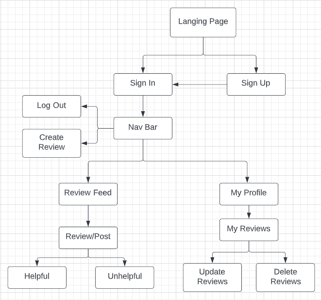
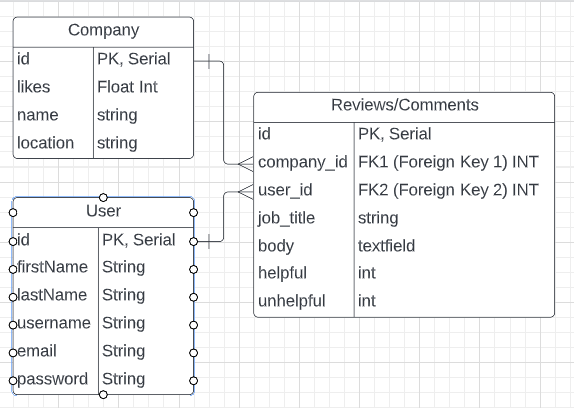

# **OK-Corporate**

A full-stack app for users to leave reviews on their work experiences at companies.

#### Capstone Project

---

#### [LinkedIn] (https://www.linkedin.com/in/ryanditzel/)

---

### Technologies Used:

## Github, Figma, Trello, VS Code, Material UI

---

## **Summary**

OK Corporate is a site for users to leave reviews of the companies that they have worked at. Similar to Glassdoor, OK Corporate will have the ability to post reviews with a ratings system and will have a helpful and unhelpful button so the community can deem which reviews are most important. A user will be able to edit and delete the reviews they create from their profile page on the site.

The front-end will be a fully functional React app with a landing page where you will be able to sign in or sign up if you are not already registered. Once past the log in page you'll see your main feed consisting of other people's reviews. There will be a Navigation Bar with links to Create Review, Feed, Your Profile, and Sign Out.

Component Hierarchy:

The back-end will be built with Django and Python. The database will be filled with Faker information for testing and display purposes.

ERD:

